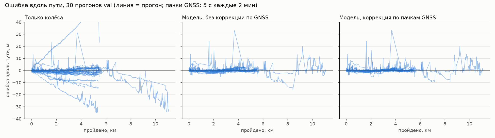

# Метрики: точность и быстродействие

Критерий: методика сравнения с GNSS-эталоном, таблицы ошибок, графики, замеры задержки,
частоты и ресурсов. Все цифры - для поставляемой версии (код, `params.yaml`, модель в
`tram_odometry/tram_odometry/data/`, откалиброванная только по train и архиву OSM).

Два режима работы:
- **без коррекции по GNSS** - GNSS только для выставки в первые 3 с, дальше колёса, контроллер
  и карта;
- **с коррекцией по GNSS** (по умолчанию) - если фиксы приходят по ходу рейса, они мягко
  поправляют положение вдоль пути (`МОДЕЛЬ.md` §6.4). Скорость от GNSS не зависит в обоих режимах.

## 1. Итог

| проверка | RMSE положения 3D: без коррекции | с коррекцией | RMSE скорости |
|---|---|---|---|
| **чекер `check-code`**, bag `30618_88aea4d9`, ROS 2 (§3) | 1.5-1.7 м | **1.1-1.2 м** | **0.049 м/с** |
| **val**, 30 рейсов, среднее / медиана / худший (§2) | 1.64 / 1.27 / 4.15 м | **1.50 / 1.19 / 4.08 м** | 0.046 м/с |
| train, 30 рейсов (калибровка), среднее / медиана | 1.32 / 0.90 м | 1.13 / 0.77 м | 0.061 м/с |

Коррекция на val и train - по пачкам GNSS 5 с каждые 2 мин. Быстродействие: 40 Гц, задержка
0.34 мс в среднем, CPU 3.4 % одного ядра, память 99 МБ (§5).

## 2. Val: 30 рейсов, ~9.5 ч, ~160 км

Значения: среднее / медиана / худший рейс.

| метрика | без коррекции по GNSS | с коррекцией по GNSS |
|---|---|---|
| RMSE положения 3D, м | **1.64** / **1.27** / 4.15 | **1.50** / **1.19** / 4.08 |
| RMSE вдоль пути, м | 1.25 / 0.86 / 4.04 | 1.07 / 0.62 / 4.05 |
| RMSE поперёк пути, м | 0.56 / 0.29 / 2.11 | 0.56 / 0.29 / 2.11 |
| RMSE по высоте, м | 0.56 / 0.35 / 2.63 | 0.56 / 0.35 / 2.63 |
| P95 ошибки положения, м | 3.28 / 2.51 / 8.96 | 3.04 / 2.26 / 7.77 |
| максимум ошибки, м | 8.1 / 6.2 / 33.0 | 7.9 / 6.2 / 33.1 |
| дрейф в конце, % пути | 0.060 / **0.012** / 1.01 | 0.045 / 0.011 / 0.60 |
| RMSE скорости, м/с | **0.046** / 0.029 / 0.174 | то же |
| смещение скорости, м/с | −0.003 / −0.005 / 0.054 | то же |

- **Без коррекции** ошибка не накапливается: её сбрасывают остановки у станций. Худшая
  мгновенная ошибка 33 м - конец одного рейса на западной конечной (ветка «тупик» выбрана по
  скорости, `ДОПУЩЕНИЯ_И_ПАРАМЕТРЫ.md`).
- **Коррекция** улучшает 21 рейс из 30 больше чем на 0.05 м и ни один не ухудшает больше чем
  на 0.02 м. Сильнее всего выигрывают рейсы с малым числом остановок у станций.
- **Поперёк пути и высота** от коррекции не зависят: это точность карты.

Другие частоты GNSS по ходу рейса:

| GNSS по ходу рейса | val: RMSE 3D, среднее / медиана / худший | train: среднее / медиана / худший |
|---|---|---|
| нет | 1.64 / 1.27 / 4.15 м | 1.32 / 0.90 / 6.79 м |
| пачки 5 с каждые 2 мин | 1.50 / 1.19 / 4.08 м | 1.13 / 0.77 / 5.77 м |
| по фиксу каждой антенны раз в 30 с | 1.45 / 1.15 / 4.05 м | 1.14 / 0.79 / 5.77 м |
| весь рейс (эталон - тот же GNSS, оценка оптимистична) | 1.38 / 1.13 / 4.07 м | 1.07 / 0.71 / 5.82 м |

Во всех режимах ни один рейс не хуже, чем без коррекции, больше чем на 0.06 м, кроме val
`0f120b35` при GNSS весь рейс (0.58 → 0.71 м). Отбор фиксов нужен: без сверки антенн сбойные
RTK-фиксы портили train `3e9f4952` (0.65 → 2.72 м, со сверкой 0.59 м), без порога 6 м для
ветки - val `27e994fc` (4.51 м, с порогом 2.97 м).

## 3. Чекер `check-code` (независимый bag)

Пакет `check-code`: узел `metrics`, эталон `/localization/kinematic_state`, bag
`30618_88aea4d9` (~22 мин, не входил ни в train, ни в val), `ros2 bag play --rate 2`, наш узел
с `params.yaml` и нашим пакетом сообщений. GNSS в этом bag приходит всю запись редкими пачками
по 1-2 с; режим без коррекции - `gnss_correction:=false`.

| | без коррекции по GNSS | с коррекцией по GNSS |
|---|---|---|
| **RMSE положения 3D, ROS** | 1.61 м (разброс прогонов 1.5-1.7) | **1.16 м** (разброс 1.1-1.2) |
| max 3D, ROS | 19.7 м | 11.1 м |
| RMSE z, ROS | 0.19 м | 0.21 м |
| **RMSE скорости, ROS** | **0.049 м/с** | **0.049 м/с** |
| медиана / p95 мгновенной ошибки (офлайн) | 0.51 / 1.72 м | 0.53 / 1.71 м |
| RMSE за минуты 0-20 / последнюю минуту (офлайн) | 0.79 / 6.0 м | 0.79 / 3.8 м |

- **Вся разница - последняя минута.** Трамвай заезжает на соседний путь тупика западной
  конечной, которого нет на карте (3-3.5 м от нашего). Без GNSS оценка уходит вдоль нашего
  тупика, с GNSS переходит на ближайшую ветку. До этого медиана и p95 одинаковы.
- **Разброс прогонов** - время доставки сообщений в ROS каждый раз немного другое.
- **Порог развилки** 5.0 м/с выбран после этого bag (въезд в тупик на 5.44 м/с) и проверен на
  val и train, поэтому для него bag чекера - не независимая проверка.
- **Эталон скорости** чекера отстаёт от датчиков на ~0.09 с. Сдвиг нашей скорости на 0.09 с дал
  бы на этом bag 0.025 м/с, но относительно GNSS-скорости на val только ухудшает (медиана
  0.029 → 0.053 м/с). Мы это не компенсируем: скорость публикуется на момент её штампа.

## 4. Методика

- **Данные.** 97 уникальных прогонов (122 минус 25 побайтных дубликатов), у 64 есть
  GNSS-эталон. Поровну: **train** - только калибровка (маршруты, станции, модель тяги, масштаб
  колёс), **val** - оценка. Из val исключены 2 прогона, где GNSS появляется через 364 и 988 с.
  Val использовался для выбора вариантов модели, поэтому независимая проверка - bag чекера.
- **Воспроизведение причинное:** события в порядке `header.stamp`, ядро то же, что в узле.
  GNSS после окна выставки отдаётся оценщику только в режимах с коррекцией. Проверка: если
  заменить GNSS после выставки мусором, выход без коррекции не меняется (178 648 выходов).
- **Эталон положения** - `base_link` из двух антенн по tf организаторов:
  `master + 9.873·unit(rover − master)`, `z = alt − 3.0`, MGRS 37U; фиксы `status == 2`, где
  антенны отстоят не больше чем на 60 мс. **Эталон скорости** - `|master/vel|`.
- **Сопоставление** - ближайший штамп с допуском 0.05 с, как у чекера. Метрики считаются по
  рейсу, затем среднее / медиана / худший по рейсам. Дрейф - ошибка в последней точке,
  делённая на пройденный путь.
- **Запуск:** `python analysis/evaluate.py val` (без коррекции), `TRAM_EVAL_GNSS=burst|sparse|all`
  (с коррекцией); `analysis/plot_results.py` - график и таблица по рейсам
  [`results_val.csv`](results_val.csv) (оба режима); `analysis/robustness.py` - §5.

## 5. Устойчивость к сбоям

Искусственные сбои на входах 16 рейсов val, без коррекции по GNSS. «Без модели» - среднее
тележек, «с моделью» - итоговый фильтр.

| сценарий | RMSE скорости, м/с: без → с моделью | RMSE положения, м: без → с моделью |
|---|---|---|
| без сбоев | 0.053 → **0.041** | 2.02 → **1.67** |
| задняя тележка «залипла» в 0 на 30 с (×3 за рейс) | 1.050 → **0.042** | 179.2 → **1.69** |
| 1 % выбросов ±20…60 км/ч | 0.451 → **0.044** | 7.48 → **1.74** |
| 5 % NaN и отрицательного мусора | 0.054 → **0.041** | 2.03 → **1.68** |
| обе тележки молчат 3 с каждую минуту | 0.188 → **0.094** | 6.67 → **2.67** |
| пробуксовка обеих тележек +15 % на 4 с (×10) | 0.276 → 0.226 | 19.7 → 13.5 |
| юз обеих тележек −25 % на 3 с (×10) | 0.266 → 0.265 | 25.4 → 24.0 |

Отказ одной тележки, выбросы, мусор и пропуски парируются полностью. Синхронное
проскальзывание обеих тележек обнаруживается (флаг `slip`), но компенсируется лишь частично:
модель тяги слишком груба. В реальных данных такого проскальзывания нет (колёса совпадают со
скоростью GNSS с RMSE 0.03 м/с); есть отказ датчика: задняя тележка `30639_3b3d9eb8` ~30 с
показывает 0 на ходу.

## 6. Быстродействие

ROS 2 Humble, `ros2 bag play --rate 1`, bag чекера, 4-ядерная виртуальная машина.

| показатель | значение | требование |
|---|---|---|
| частота `/result/velocity` и `/result/position` | 40 Гц (на каждое входное сообщение) | ≥ 10 Гц, рекоменд. 20-50 |
| задержка вход → публикация, среднее | 0.34 мс | ≤ 100 мс |
| задержка, максимум | 12.5 мс (99 % секундных максимумов ≤ 3.6 мс) | пик ≤ 250 мс |
| CPU узла | 3.4 % одного ядра | ≤ 2 ядра |
| память (RSS) | 99 МБ, не растёт | ≤ 0.5 ГБ |
| ядро оценщика офлайн | 18 мкс на выход | - |

Истории и окна ограничены по времени, маршруты загружаются один раз. Интернет не нужен.

## 7. Вклад блоков и проверенные гипотезы

RMSE положения на val без коррекции по GNSS, среднее / медиана / худший:

| версия | RMSE положения |
|---|---|
| только колёса, `s += v·dt` по карте | 6.01 / 2.77 / 35.0 м |
| + станции, модель тяги, очереди, развилка | 3.27 / 1.62 / 18.8 м |
| + масштаб пути по станциям, OSM-геометрия конечных, выбор варианта при выставке | 1.78 / 1.42 / 4.55 м |
| + поправка пути трапецией при обновлении скорости | 1.65 / 1.36 / 4.18 м |
| + высота достроенных участков (итог) | **1.64 / 1.27 / 4.15 м** |
| + коррекция по пачкам GNSS | **1.50 / 1.19 / 4.08 м** |

| гипотеза | результат на val |
|---|---|
| Положение как 1-D координата вдоль карты | ✅ основа решения |
| Станции как контрольные точки (повтор остановки 0.1-0.2 м) | ✅ худший рейс 35 → 13 м |
| Масштаб колёс по вагону | ✅ вагон 30639 занижает на 0.27 % |
| Места очередей и светофоров как отдельная гипотеза стоянки | ✅ 3.72 → 3.63 м |
| Развилка «кольцо / тупик» по скорости | ✅ 3.63 → 3.27 м |
| Масштаб пути регрессией по станциям | ✅ 3.27 → 1.78 м (вместе с OSM и выбором варианта) |
| Геометрия конечных по OSM | ✅ худший рейс 18.8 → 4.7 м |
| Модель тяги в прогнозе скорости | ✅ 0.053 → 0.041 м/с, парирует отказы датчиков |
| Поправка пути трапецией | ✅ 1.78 → 1.65 м |
| Коррекция по GNSS со сверкой антенн | ✅ 1.64 → 1.50 м (пачки), чекер 1.61 → 1.16 м |
| Места начала торможения как маяки | ❌ 3.27 → 3.29…3.87 м |
| Резкие повороты как контрольные точки | ❌ без курса ненаблюдаемы |
| Восстановление по двум одинаковым невязкам станций | ❌ ложные поправки у очередей |
| Жёсткий детектор юза (порог 1.2 м/с²) | ❌ ложные срабатывания при экстренном торможении |
| Фильтр частиц по (s, масштаб) | ≈ как одна гипотеза, опция `along_mode: pf` |
| Сдвиг выхода скорости под эталон чекера | ❌ хуже относительно GNSS-скорости, не используется |
